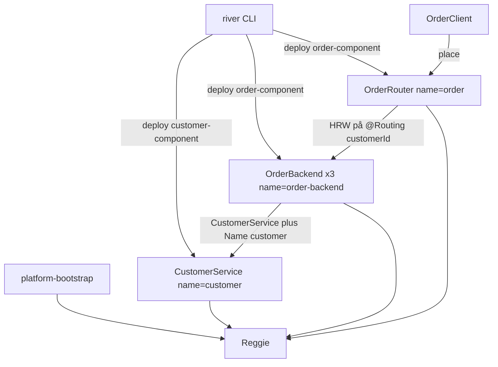

# GradinITRiverExample

Ett fristående exempel som använder [GradinITRiver](https://github.com/GradinIT/GradinITRiver) (`se.gradinit.river`, version `3.0.0-gradinit-SNAPSHOT`) som vanliga Maven-beroenden från GitHub Packages. Ingen plattformskod är kopierad hit.

`customer` är en komponent med en instans. `order` är en komponent med tre backendar och en router, och beror på kunden via `META-INF/order_conf.xml` (gränssnitt + Jini-`Name`). Klienten anropar routern. Routern väljer backend med plattformens HRW (`HrwSelector` och `RoutingKeys`) på `customerId`, märkt `@Routing`.

## Arkitektur



Mer om flödet finns i [docs/arkitektur.md](docs/arkitektur.md).

## Snabbstart

Kräver JDK 25 eller senare, och läsrättighet till paketen på `https://maven.pkg.github.com/GradinIT/GradinITRiver`.

1. Lägg en server med id `github` i `~/.m2/settings.xml`. Lösenordet är en token med `read:packages`. Se [docs/beroenden.md](docs/beroenden.md).

2. Bygg exemplet. Det hämtar `3.0.0-gradinit-SNAPSHOT` (`-U`) och packar upp `gradinit-river-dist`:

   ```bash
   ./mvnw -B -U -DskipITs package
   ```

   Filen `integration-tests/target/river-dist-home.txt` innehåller katalogen där `bin/river-platform`, `bin/river` och `bin/river-web-console` ligger.

3. Starta en tom plattform i en terminal. Vänta på raden `RIVER_PLATFORM_READY jini://host:port`.

   ```bash
   DIST="$(cat integration-tests/target/river-dist-home.txt)"
   "$DIST/bin/river-platform" --clean
   ```

4. Deploya komponenterna i en annan terminal. Byt `jini://host:port` mot URL:en från steg 3.

   ```bash
   export JAVA_TOOL_OPTIONS="-Dse.gradinit.river.lookup=jini://host:port"
   "$DIST/bin/river" deploy customer-component/target/customer-component-1.0.0.jar
   "$DIST/bin/river" deploy order-component/target/order-component-1.0.0.jar
   ```

5. Kör klienten. Samma `customerId` ska ge samma `backendId` på båda raderna `ORDER_OK`.

   ```bash
   mapfile -t FLAGS < <(./scripts/river-jvm-flags.sh)
   JAVA="${JAVA_HOME:-}/bin/java"
   [[ -x "$JAVA" ]] || JAVA="$(command -v java)"
   "$JAVA" "${FLAGS[@]}" -Dse.gradinit.river.lookup=jini://host:port \
     -cp "client/target/client-1.0.0.jar:$(cat client/target/classpath.txt)" \
     se.gradinit.riverexample.client.OrderClient alice SKU-100 1
   ```

6. Starta webbkonsolen i en tredje terminal, mot samma plattform. Avsluta den med Ctrl-C.

   ```bash
   export JAVA_TOOL_OPTIONS="-Dse.gradinit.river.lookup=jini://host:port"
   "$DIST/bin/river-web-console"
   ```

7. Ta ner komponenterna och stoppa plattformen med Ctrl-C i terminalen från steg 3.

   ```bash
   "$DIST/bin/river" undeploy order
   "$DIST/bin/river" undeploy customer
   ```

Enhetstesterna:

```bash
./mvnw -B -U verify
```

`OrderPlatformIT` är avstängt tills GradinITRivers supervisor skickar `--patch-module` och `--add-exports` till komponenternas barn-JVM. Den ändringen görs uppströms. Snabbstarten ovan är flödet när den SNAPSHOT finns. `./scripts/run-demo.sh` gör samma steg.

JVM-flaggorna `--patch-module java.rmi=...` och `--add-exports java.rmi/java.rmi.activation=ALL-UNNAMED` behövs för exempelklienten. `bin/river-platform` och `bin/river` sätter dem själva. Steg för steg finns i [docs/korning.md](docs/korning.md).

Versionen är pinnad med `gradinit.river.version` i `pom.xml`. Paketrepot, BOM-importen och den lokala token-konfigurationen beskrivs i [docs/beroenden.md](docs/beroenden.md).

## Moduler

| Modul | Innehåll |
| --- | --- |
| `customer-api` | `CustomerService` |
| `customer-component` | en instans, `META-INF/SLA.xml`, `META-INF/customer_conf.xml` |
| `order-api` | `OrderService` och `OrderRequest` med `@Routing` på `customerId` |
| `order-component` | tre backendar och en router, `META-INF/order_conf.xml` |
| `client` | slår upp `OrderService` + `Name("order")` |
| `example-support` | discovery, lookup och `ServiceExporter.joinAnnotated` |
| `integration-tests` | `OrderPlatformIT` |

## Dokumentation

Filer i det här repot:

- [README.md](README.md)
- [docs/arkitektur.md](docs/arkitektur.md)
- [docs/beroenden.md](docs/beroenden.md)
- [docs/korning.md](docs/korning.md)
- [docs/kanda-problem.md](docs/kanda-problem.md)

Plattformens dokumentation på `develop`:

- [GradinITRiver README](https://github.com/GradinIT/GradinITRiver/blob/develop/README.md)
- [docs/plattform.md](https://github.com/GradinIT/GradinITRiver/blob/develop/docs/plattform.md)
- [docs/exempel-tjanst.md](https://github.com/GradinIT/GradinITRiver/blob/develop/docs/exempel-tjanst.md)
- [docs/supervisor.md](https://github.com/GradinIT/GradinITRiver/blob/develop/docs/supervisor.md)
- [docs/komponent-deploy-analys.md](https://github.com/GradinIT/GradinITRiver/blob/develop/docs/komponent-deploy-analys.md)

Begränsningar, bland annat att paketen kräver en PAT med `read:packages` eftersom GradinIT är ett personligt konto, står i [docs/kanda-problem.md](docs/kanda-problem.md).
