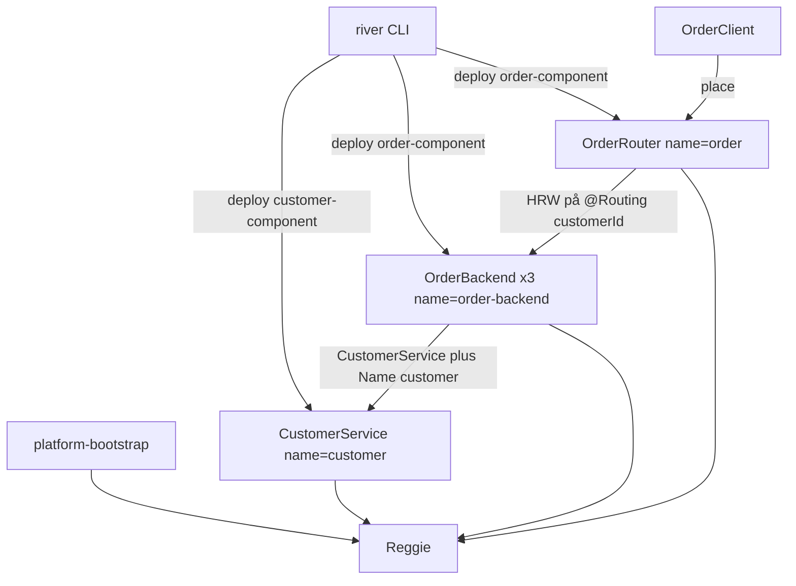

# GradinITRiverExample

Ett fristående exempel som använder [GradinITRiver](https://github.com/GradinIT/GradinITRiver) (`develop`, `se.gradinit.river`, version `3.0.0-gradinit`) som vanliga Maven-beroenden. Ingen plattformskod är kopierad hit.

`customer` är en komponent med en instans. `order` är en komponent med tre backendar och en router, och beror på kunden via `META-INF/order_conf.xml` (gränssnitt + Jini-`Name`). Klienten anropar routern. Routern väljer backend med HRW på `customerId`, märkt `@Routing`.

## Arkitektur



Mer om flödet finns i [docs/arkitektur.md](docs/arkitektur.md).

## Så här kör du

Kräver JDK 25 eller senare.

1. Installera plattformens JAR-filer från `develop` (de publiceras inte):

   ```bash
   ./scripts/install-gradinit-river.sh
   ```

2. Bygg och kör integrationstestet, som startar bootstrap, deployar båda komponenterna, anropar klienten, kör `river monitor` och undeployar:

   ```bash
   ./mvnw -B verify
   ```

3. Eller kör samma flöde som en demo:

   ```bash
   ./scripts/run-demo.sh
   ```

JVM-flaggorna `--patch-module java.rmi=...` och `--add-exports java.rmi/java.rmi.activation=ALL-UNNAMED` sätts av `scripts/river-jvm-flags.sh`. Steg för steg, inklusive kommandona för hand, finns i [docs/korning.md](docs/korning.md).

Versionen är pinnad med `gradinit.river.version` i `pom.xml`. Hur beroendet löses, varför JitPack inte används, och rekommendationen att publicera till GitHub Packages beskrivs i [docs/beroenden.md](docs/beroenden.md).

## Moduler

| Modul | Innehåll |
| --- | --- |
| `customer-api` | `CustomerService` |
| `customer-component` | en instans, `META-INF/SLA.xml`, `META-INF/customer_conf.xml` |
| `order-api` | `OrderService` och `OrderRequest` med `@Routing` på `customerId` |
| `order-component` | tre backendar och en router, `META-INF/order_conf.xml` |
| `client` | slår upp `OrderService` + `Name("order")` |
| `integration-tests` | `OrderPlatformIT` |

## Dokumentation

Filer i det här repot:

- [README.md](README.md)
- [docs/arkitektur.md](docs/arkitektur.md)
- [docs/beroenden.md](docs/beroenden.md)
- [docs/korning.md](docs/korning.md)
- [docs/kanda-problem.md](docs/kanda-problem.md)

Plattformens dokumentation på `develop`:

- [GradinITRiver README](https://github.com/GradinIT/GradinITRiver/blob/develop/README.md)
- [docs/plattform.md](https://github.com/GradinIT/GradinITRiver/blob/develop/docs/plattform.md)
- [docs/exempel-tjanst.md](https://github.com/GradinIT/GradinITRiver/blob/develop/docs/exempel-tjanst.md)
- [docs/supervisor.md](https://github.com/GradinIT/GradinITRiver/blob/develop/docs/supervisor.md)
- [docs/komponent-deploy-analys.md](https://github.com/GradinIT/GradinITRiver/blob/develop/docs/komponent-deploy-analys.md)

Begränsningar som gör extern användning svårare, bland annat opublicerade artefakter, 404 vid checkout och JVM-flaggorna, står i [docs/kanda-problem.md](docs/kanda-problem.md).
