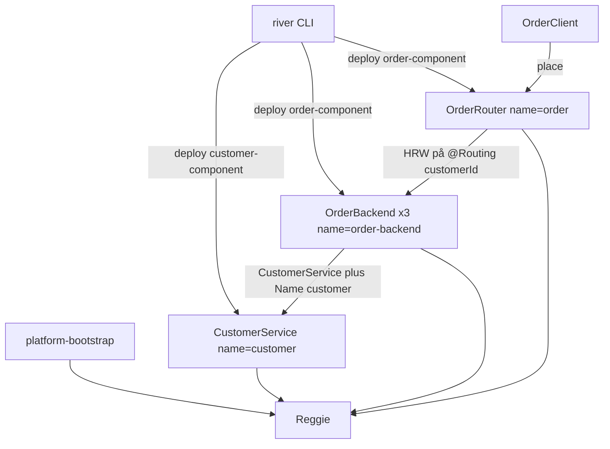

# Arkitektur

En komponent är en JAR med klasser märkta `@ExportedService`, `META-INF/SLA.xml` (instanser per tjänst) och `META-INF/{komponent}_conf.xml` (beroenden som fjärrgränssnitt plus Jini-`Name`).

`customer` har en instans av `CustomerService` med namnet `customer`. Den har inga beroenden.

`order` har tre backend-instanser (`OrderService`, namn `order-backend`, roll `backend`) och en router (`OrderService`, namn `order`, roll `router`). `order_conf.xml` pekar på `CustomerService` + `customer`. Routern väljer backend med HRW på posten `customerId`, som är märkt `@Routing`. Backend slår upp kunden och skapar ordern.

Klientens mall är `OrderService` + `Name("order")`, alltså routern, inte en enstaka backend.

`@PersistenceClass` finns i plattformen och är reserverad. Exemplet använder den inte.

Plattformens egna hello-flöde, SLA-reglerna och supervisorn beskrivs i GradinITRiver:

- [README](https://github.com/GradinIT/GradinITRiver/blob/develop/README.md)
- [docs/plattform.md](https://github.com/GradinIT/GradinITRiver/blob/develop/docs/plattform.md)
- [docs/exempel-tjanst.md](https://github.com/GradinIT/GradinITRiver/blob/develop/docs/exempel-tjanst.md)
- [docs/supervisor.md](https://github.com/GradinIT/GradinITRiver/blob/develop/docs/supervisor.md)
- [docs/komponent-deploy-analys.md](https://github.com/GradinIT/GradinITRiver/blob/develop/docs/komponent-deploy-analys.md)
